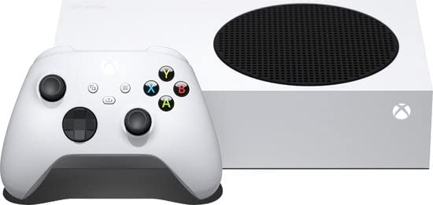
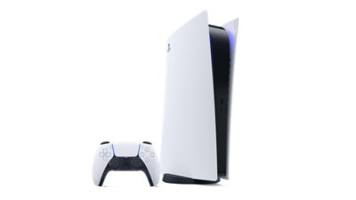
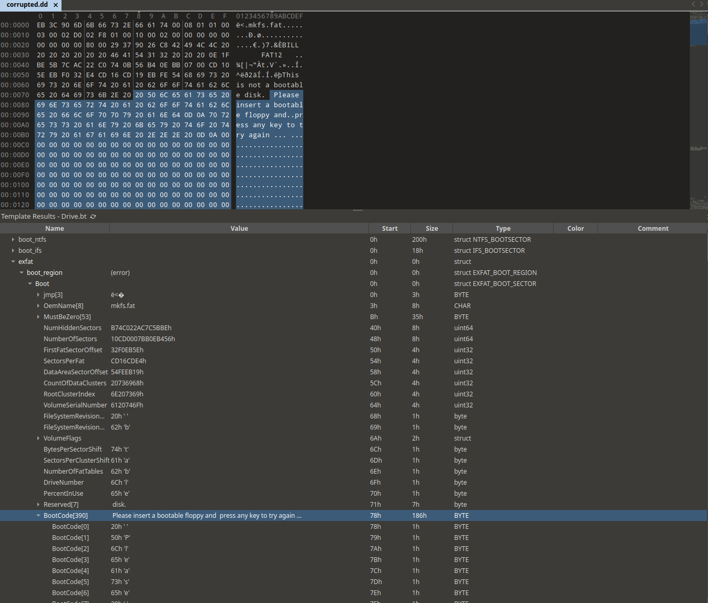
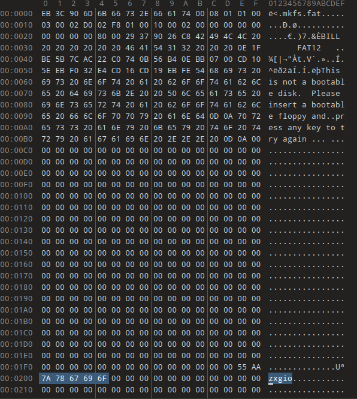

# Console.dd

```
Something fishy is going on. Someone gave us this image of an unpartitioned FAT filesystem containing a JPEG picture. However, this volume seems to have just been (re)formatted to hide something.

Can you reconstruct the original partition scheme and recover the content of the original partition?
```

## Verify the image

```
> sha256sum --check console.dd.sha256
console.dd: OK
```

## Analysis

I started by running **TSK - fls** to list files and directories in the image since I read that there was a JPEG picture inside the provided image

```
> fls console.dd

r/r 4:	xbox.jpg
v/v 130867:	$MBR
v/v 130868:	$FAT1
v/v 130869:	$FAT2
V/V 130870:	$OrphanFiles
```

There was indeed a JPEG file that I could analyse so I extracted it directly by its name using  **TSK - fcat** 

```
fcat xbox.jpg console.dd > xboxjpg_extracted.jpg 
```




After that I ran **TSK - fsstat** to display general details of the file-system provided and **TSK - mmls** to get the partition layout.


```
> fsstat console.dd

File System Type: FAT12

OEM Name: mkfs.fat
Volume ID: 0xb9e28db8
Volume Label (Boot Sector): NO NAME    
Volume Label (Root Directory):
File System Type Label: FAT12   

Sectors before file system: 0

File System Layout (in sectors)
Total Range: 0 - 8191
* Reserved: 0 - 0
** Boot Sector: 0
* FAT 0: 1 - 6
* FAT 1: 7 - 12
* Data Area: 13 - 8191
** Root Directory: 13 - 44
** Cluster Area: 45 - 8188
** Non-clustered: 8189 - 8191

METADATA INFORMATION
--------------------------------------------
Range: 2 - 130870
Root Directory: 2

CONTENT INFORMATION
--------------------------------------------
Sector Size: 512
Cluster Size: 2048
Total Cluster Range: 2 - 2037
fcat ps5.jpg linuxfs_extracted.dd > ps5jpg_extracted.jpg
FAT CONTENTS (in sectors)
--------------------------------------------
49-76 (28) -> EOF
```

```
> mmls console.dd

GUID Partition Table (EFI)
Offset Sector: 0
Units are in 512-byte sectors

      Slot           Start           End            Length          Description
000:  -------        0000000000      0000002047     0000002048      Unallocated
001:  002            0000002048      0000008158     0000006111      Linux filesystem
002:  Meta           0000008159      0000008190     0000000032      Partition Table
003:  -------        0000008159      0000008191     0000000033      Unallocated
004:  Meta           0000008191      0000008191     0000000001      GPT Header
```

From the output of **TSK - mmls** I saw that apparently there was a Linux filesystem located in the first partition so I tried to extract it using **TSK - mmcat** 

```
> mmcat console.dd 1 > linuxfs_exctracted.dd
```

After that I ran again **TSK - fsstat** on the newly acquired raw image in order to gather informations about that

```
> fsstat linuxfs_extracted.dd

FILE SYSTEM INFORMATION
--------------------------------------------
File System Type: NTFS
Volume Serial Number: 46ACAF237FF4C000
OEM Name: NTFS    
Version: Windows XP

METADATA INFORMATION
--------------------------------------------
First Cluster of MFT: 4
First Cluster of MFT Mirror: 381
Size of MFT Entries: 1024 bytes
Size of Index Records: 4096 bytes
Range: 0 - 65
Root Directory: 5

CONTENT INFORMATION
--------------------------------------------
Sector Size: 512
Cluster Size: 4096
Total Cluster Range: 0 - 762
Total Sector Range: 0 - 6109

$AttrDef Attribute Values:
$STANDARD_INFORMATION (16)   Size: 48-72   Flags: Resident
$ATTRIBUTE_LIST (32)   Size: No Limit   Flags: Non-resident
$FILE_NAME (48)   Size: 68-578   Flags: Resident,Index
$OBJECT_ID (64)   Size: 0-256   Flags: Resident
$SECURITY_DESCRIPTOR (80)   Size: No Limit   Flags: Non-resident
$VOLUME_NAME (96)   Size: 2-256   Flags: Resident
$VOLUME_INFORMATION (112)   Size: 12-12   Flags: Resident
$DATA (128)   Size: No Limit   Flags: 
$INDEX_ROOT (144)   Size: No Limit   Flags: Resident
$INDEX_ALLOCATION (160)   Size: No Limit   Flags: Non-resident
$BITMAP (176)   Size: No Limit   Flags: Non-resident
$REPARSE_POINT (192)   Size: 0-16384   Flags: Non-resident
$EA_INFORMATION (208)   Size: 8-8   Flags: Resident
$EA (224)   Size: 0-65536   Flags: 
$LOGGED_UTILITY_STREAM (256)   Size: 0-65536   Flags: Non-resident
```

From the output I saw that it was a NTFS filesystem, used by the Microsoft-Windows OS, unexpected since the name of that partition suggested that it would be a Linux filesystem but this could be due to the fact the GPT partition description may have been altered.
Just as I did before I ran **TSK - fls** on the new image to list files and directories

```
> fls liuxfs_extracted.dd
r/r 4-128-1:	$AttrDef
r/r 8-128-2:	$BadClus
r/r 8-128-1:	$BadClus:$Bad
r/r 6-128-1:	$Bitmap
r/r 7-128-1:	$Boot
d/d 11-144-2:	$Extend
r/r 2-128-1:	$LogFile
r/r 0-128-1:	$MFT
r/r 1-128-1:	$MFTMirr
r/r 9-128-2:	$Secure:$SDS
r/r 9-144-3:	$Secure:$SDH
r/r 9-144-4:	$Secure:$SII
r/r 10-128-1:	$UpCase
r/r 10-128-2:	$UpCase:$Info
r/r 3-128-3:	$Volume
r/r 64-128-2:	ps5.jpg
V/V 65:	$OrphanFiles
```

From the output I saw that there was another jpg picture so I extracted it as well
using **TSK - fcat**

```
fcat ps5.jpg linuxfs_extracted.dd > ps5jpg_extracted.jpg
```



This should have been the content of the original partition.
So the volume was originally partitioned using GPT and an NTFS filesystem was created in a partition.
After that a ps5 image was saved on it but then a FAT12 was located in the first 2048 sectors erasing part of the GPT data.

# Corrupted.dd

```
Is the image partitioned/bootable? If partitioned, list all partitions.

Inside, you'll find a FAT FS:
- what is the volume label?
- what is the sector size?
- what is the cluster size?
- how many FAT tables are present?
- are there sectors that are unused by the FS? If yes, what do they contain?

How many files/deleted-files with extension TXT are there?
Can you read them by readonly-mounting them/by using TSK? Why?

One of them should correspond to SHA256
e9207be4a1dde2c2f3efa3aeb9942858b6aaa65e82a9d69a8e6a71357eb2d03c
... which one?

If you cannot extract such content, something is corrupted (hint hint); find the root cause and fix the file system before continuing.
You must explain how you found and fixed the problem.

Inside the file corrupted.dd there are some occurrences of the string "zxgio" (without quotes); can you list their offset in bytes?

For each occurrence of such a string, determine its location with respect to the FAT file system. For instance, is the string contained inside a file? Is it in some unused/slack space? In other areas?
```

## Verify the image

```
> sha256sum --check corrupted.dd.sha256
corrupted.dd: OK
```

## Analysis

#### Is the image partitioned/bootable? If partitioned, list all partitions.

In order to list partitions I used, as I did previously, **TSK - mmls** that doesn't output anything so we can infer that the image is not partitioned.
In order to understand whether the image is bootable or not we can take a look with a hex-editor at the boot-code in the header and analyse it.



As we can see the image seems not to be bootable.

#### What is the volume label?
From **TSK - fsstat** : **BILL**

#### What is the sector size?
 From **TSK - fsstat** : **2048**

#### What is the cluster size?
From **TSK - fsstat** : **2048**

#### How many FAT tables are present?

From **TSK - fsstat** : **3**

```
* FAT 0: 1 - 1
* FAT 1: 2 - 2
* FAT 2: 3 - 3
```

#### Are there sectors that are unused by the FS? If yes, what do they contain?

We can check if there are any unused sectors by getting first the total number of sectors.
This can be done easily by getting the file size and dividing it by the sector size.
I used **stat** to get the file size and  I already had the sector size from **TSK - fsstat**

```
> stat -c %s corrupted.dd 
1476608

> echo $(( 1476608 / 2048 ))
721
```

Considering the fact that there are 721 sectors but **TSK - fsstat** outputed as last sector used the 719th I inferred that there were 2 sectors unused.
Using **dd** I then extracted the data in those sectors

```
> dd if=corrupted.dd of=lastsectors.out bs=2k skip=720 
```

```
> less lastsectors.out 

R0lGODlhVgAhALMLAP///wAAAP//AP/kAOu9ArZ9A9KfAYBUALOzs7F1AWwADgAAAAAAAAAAAAAAAAAAACH/C05FVFNDQVBFMi4wAwEAAAAh+QQFCgALACwAAAAAVgAhAAAE/3DJSau9OOvNd/hgKI5kaZ5o+lUB4L5wLM90bd+4G1Bt7v/AIGw36QFaRuEriWMqYz2ixIh8Wq+0KG951IlkoGXUS/1AyeKo+bhmc49b3VDefY+792rdLnfWx3k6cXt/dHSBiIaHh2WIYX+DSYF8hYmEhYR6lmCRc5hpYot/baJIayGlp4JFSnc5rlhNg0Gkr36xWbO4u7hSUyrAwcImUCMdx8jJx5K+ys7P0GXQ09TJatXY2QXbBwc8K9nh0NsDAwTn4OLqzwUDAu/v5gTN6/Ua7fD58vT2/RQFAkDAAzHPn8EK7QIgUBgg4BID/A6uSwgAwRGHFgNAlHiQoo6AC0QXbuTo74A7ge8IjiRpz2S5fPEGGEgQkWW2AwTcBfxQjgBNmyXPDQigoGgAAjNrAsWGE92HmT+XljxgoGpSpVLDiagWAQAh+QQFCgALACw4ABcACQAIAAAEEnABsGpFweqAtKReKI6klVVnBAAh+QQFCgALACw4ABcACQADAAAECxCsOVFYklIZkMYRACH5BAUKAAsALDgAFwAJAAMAAAQMcC0kJQAyVL1unVIEADs=...

```

Running some analysis tools on the file I discovered that it was base64 encoded
so I decoded it

```
> base64 -d lastsectors.out > lastsectors
```


#### How many files/deleted-files with extension TXT are there?

```
> fls corrupted.dd | grep -i txt

r/r 45:	HOMEWORK.TXT
r/r 32:	NETWORKS.TXT
r/r * 36:	_EADME.TXT
```

I found out that there were only three txt files and one of them,  _\_EADME.TXT_, had been deleted

#### Can you read them by readonly-mounting them/by using TSK? Why?

Using **TSK - fls**  and **TSK - icat** I was able to read the files

```
> fls corrupted.dd

r/r 45:	HOMEWORK.TXT
r/r 3:	BILL        (Volume Label Entry)
r/r 4:	ATTRIB.EXE
r/r 5:	AUTOEXEC.BAT
r/r 6:	CHKDSK.EXE
r/r 7:	COMMAND.COM
r/r 8:	CONFIG.SYS
r/r 9:	COUNTRY.SYS
r/r 10:	COUNTRY.TX_
r/r 11:	DEBUG.EXE
r/r 12:	DEFRAG.EXE
r/r 13:	DEFRAG.HL_
r/r 14:	DOSSETUP.INI
r/r 15:	DRVSPACE.BIN
r/r 16:	EDIT.COM
r/r 17:	EGA.CP_
r/r 18:	EGA2.CP_
r/r 19:	EGA3.CP_
r/r 20:	EMM386.EX_
r/r 21:	EXPAND.EXE
r/r 22:	FDISK.EXE
r/r 23:	FORMAT.COM
r/r 24:	IO.SYS
r/r 25:	ISO.CP_
r/r 26:	KEYB.COM
r/r 27:	KEYBOARD.SYS
r/r 28:	KEYBRD2.SY_
r/r 29:	MEM.EX_
r/r 30:	MSCDEX.EXE
r/r 31:	MSDOS.SYS
r/r 32:	NETWORKS.TXT
r/r 33:	NLSFUNC.EXE
r/r 34:	PACKING.LST
r/r 35:	QBASIC.EXE
r/r * 36:	_EADME.TXT
r/r 37:	REPLACE.EX_
r/r 38:	RESTORE.EX_
r/r 39:	SCANDISK.EXE
r/r 40:	SCANDISK.INI
r/r 41:	SETUP.EXE
r/r 42:	SETUP.MSG
r/r 43:	SYS.COM
r/r 44:	XCOPY.EX_
v/v 45827:	$MBR
v/v 45828:	$FAT1
V/V 45831:	$OrphanFiles
 
```

```
> icat corrupted.dd 45 > homeworks.txt | less homeworks.txt

zxgio

```

```
> icat corrupted.dd 32 > networks.txt | less networks.txt


NETWORKS.TXT

This file contains information about making your network compatible
with MS-DOS 6.21.

This file contains the following sections:

1.  MS-DOS Shell and Networks
2.  3+Share
3.  Arcnet systems
4.  Artisoft LANtastic
5.  AT&T StarGroup (non-LAN Manager)
6.  Banyan VINES
7.  DEC Pathworks and PCSA
8.  IBM PC LAN
9.  IBM DOS LAN Requester Version 1.30 or Earlier
10. Microsoft LAN Manager and 100-Percent Compatible
    Networks
11. Microsoft MS-Net and 100-Percent Compatible
    Networks
12. Net/One PC
13. Novell Networks
14. PC-NFS 3.0
15. TCS 10Net or DCA 10Net

[...]

```

```
> icat corrupted.dd 36 > readme_deleted.txt | less readme_deleted.txt

README.TXT 

NOTES ON MS-DOS 6.22
====================
This file provides important information not included in the
MICROSOFT MS-DOS USER'S GUIDE or in MS-DOS Help.

This file is divided into the following major sections:

1. Setup
2. MemMaker, EMM386, and Memory Management
3. Windows
4. Hardware Compatibility with MS-DOS 6.22
5. Microsoft Backup, Defrag and Anti-Virus
6. Third-Party Programs
7. DriveSpace

If the subject you need information about doesn't appear in
this file, you might find it in one of the following text
files included with MS-DOS:

* OS2.TXT, which describes how to remove and save data on your
  computer when you replace OS/2 with MS-DOS 6.22.

* NETWORKS.TXT, which describes how to update your network software
  for use with MS-DOS 6.22.

* COUNTRY.TXT, which provides details about enhancements to the 
  international keyboard and codepage (character set) support
  included with MS-DOS 6.22.

[...]

``` 

Readonly-mounting them I was only able to read the content of _HOMEWORKS.TXT_ so I needed to repair the FS before continuing the analysis.  
  
Following the hint provided I looked into the image for something off in the image and since I knew from  **TSK - fsstat** that there were three FATs after the MBR I tried to extract them using **dd** and see  their content.

```
> dd if=corrupted.dd of=fat0 bs=2K skip=1 count=1
> dd if=corrupted.dd of=fat1 bs=2K skip=2 count=1
> dd if=corrupted.dd of=fat2 bs=2K skip=3 count=1
```

Running **file** on all three files I discovered that the first FAT was replaced by the following picture


So that must had been the cause of corruption.  
Running **file** on the other two files outputted only _data_ so I inferred that they would be actually backups of the first FAT.  
In order to check that I ran **diff** on them and nothing showed so I could go on and fix the FS that could be done by replacing the picture in FAT0 with FAT1.  
This operation could be done with dd.

```
> cp corrupted.dd fixed.dd
> dd if=fat1 of=fixed.dd bs=2K seek=1 conv=notrunc
```

Doing so I was able to mount the filesystem and analyse correctly the txt files.
Like that I checked also their hash  looking for the one matching **e9207be4a1dde2c2f3efa3aeb9942858b6aaa65e82a9d69a8e6a71357eb2d03c**

```
> sha256sum *.TXT

9b4a458763b06fefc65ba3d36dd0e1f8b5292e137e3db5dea9b1de67dc361311  HOMEWORK.TXT
e9207be4a1dde2c2f3efa3aeb9942858b6aaa65e82a9d69a8e6a71357eb2d03c  NETWORKS.TXT

```

And surely enough NETWORKS.TXT seemed to match my research.

#### Inside the file corrupted.dd there are some occurrences of the string "zxgio" (without quotes); can you list their offset in bytes?

```
> srch_strings corrupted.dd -a -t x | grep zxgio

200 zxgio
b10 zxgio
b0c39 zxgio
135800 zxgio
```

#### For each occurrence of such a string, determine its location with respect to the FAT file system. For instance, is the string contained inside a file? Is it in some unused/slack space? In other areas?

The first occurrence can be found at a pretty low address, **0x200**, so by opening the file with a hex-editor I found that it was just after the boot sector



The second _zxgio_ has an address slighltly higher, **0xb10**.
Since the sector size is 2048 I inferred that the image which substituted the first FAT could contain the occurrence.

```
> strings fat0.gif | grep zxgio
zxgio
```

Following the same logic as above the third _zxgio_  could be found in the sector 353, obtained by converting the address to decimal and then dividing by the sectors'size
( 724025 / 2048 ).
So I used **dd** the get the data contained in that sector

```
> dd if=corrupted.dd of=third_zxgio bs=2K skip=353 count=1
> less third_zxgio

nabled. To prevent this, use the
PC-NFS /D switch to specify the number of drives you are using. For
more information, see your PC- NFS documentation.

If you can't use the COPY or XCOPY command on PC-NFS 3.01, contact
your vendor to get an updated version of the PCNFS.SYS device driver.

If you use PC-NFS network software, carry out the following procedure
before you run MemMaker:

1. Open your MEMMAKER.INF file using any text editor. This file is
   in the directory that contains your MS-DOS files.

2. Add the following line to the file:

   *NET

3. Save the file, and then run MemMaker.

15. TCS 10Net or DCA 10Net
==========================
DCA 10Net Plus Versions 4.20 (20) and later, and DCA 10Net versions
3.3 (41) and later are compatible with MS-DOS 6.21. If you have an
earlier version, contact your network vendor for an update.

NOTE  Microsoft Defragmenter program is incompatible with 10Net
network software if the server service is loaded. If only the
redirector is loaded, the program is compatible with 10Net network
software.
zxgio
```

I saw that before the occurrence there was some some text and after mounting the fixed version of the image and looking through the files I found a match in the _NETWORKS.TXT_ file but it didn't show _zxgio_ at the end.
So I checked the slack space of the file and there it was

```
> fcat -s NETWORKS.TXT fixed.dd

NETWORKS.TXT

This file contains information about making your network compatible
with MS-DOS 6.21.

This file contains the following sections:

1.  MS-DOS Shell and Networks
2.  3+Share

[...]

NOTE  Microsoft Defragmenter program is incompatible with 10Net
network software if the server service is loaded. If only the
redirector is loaded, the program is compatible with 10Net network
software.
zxgio
```

Doing the same arithmetic as above I found that the fourth _zxgio_ was located at sector 619.
Analyzing with a hex-editor I saw that around the occurence there was nothing that could suggest its location so I run **TSK - fls** in order to get the inode number of the files in the image and then looked among the highest ones to see which one used the sector 619 using **TSK - istat**.
The inode 45, corresponding to the _HOMEWORK.TXT_ file, seemed to use that sector so I used once again **TSK - fcat** to print the content

```
> fcat HOMEWORK.TXT fixed.dd
zxgio
```

# Strange.dd


