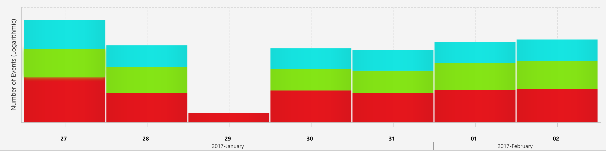
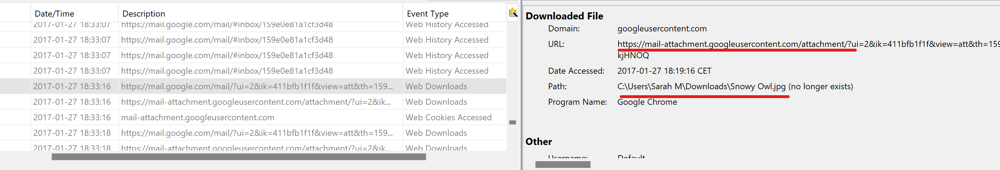
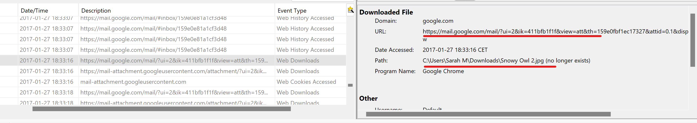
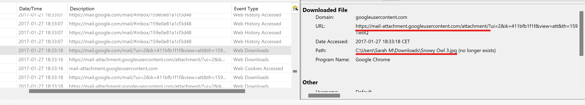
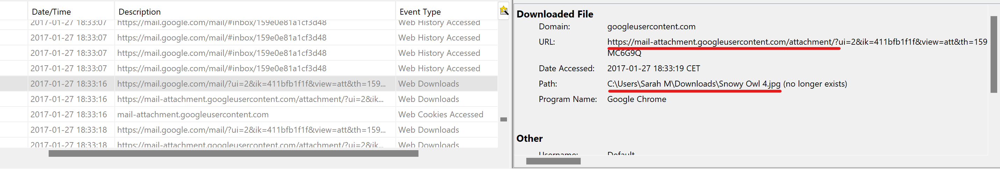

# Windows Forensic Analysis Assignment

```
Build a timeline of events for the HD01.E01 forensic image

Submit

A spreadsheet with a detailed timeline
A document explaining what happened on the system in each day in which it was used

The spreadsheet must contain, at least, the following elements:

- MFT (for relevant files)
- System Registry
- User Registry
- LNK files
- Jumplists
- Shellbags
- USB device analysis
- Prefetch
- Google Chrome
```

# Timeline creation

The complete timeline can be found in the "Timeline" folder along with a set of sub-timelines each one considering every voice of the ones requested.

# Device usage analysis

## Evidence

💿 [Image file download](https://digitalcorpora.s3.amazonaws.com/corpora/scenarios/2019-owl/HD1.zip)

## Scenario

```
In a jurisdiction where Owls are illegal to trade and buy,
two users are discussing the illegal trade of owls.
The computer and mobile device taken into evidence are of a user who
is attempting to purchase owls illegally.
The user has contacted another user who can provide an owl
in exchange for cash. An owl is decided upon, and an exchange is
scheduled. After the exchange, a communication message is sent 
confirming the owl purchase has been completed.
```

The target's name is Sarah McAvoy and looking at the image with different tools it appears that her activity was condensed in a time-span from **1/27/2017** to **2/2/2017**.





The provided image offers an overview of the target's activity in the considered timespan where:

- Red indicates File-System activity ( File Accessed, Changed, Created or Modified )

- Green indicates Web-Activity ( Web Bookmarks, Web Cache, Web Cookies Created/Accessed, Web Form Autofill Created/Accessed, Web Downloads, Web History Created/Accessed, Web Searches )

- Turquoise indicates other activities ( Backups, Bluetooth Connections, Calendar activities, Calls, USB Devices attached, Documents accessed, Emails sent/received, GPS activities...)

## User activity [ 1/27/2017 ]

The target downloaded and set up Chrome at **00:55** and  surfed the web looking at different topics all related to mythical beasts and harry potter, especially owls.

At **01:06** she downloaded three jpg files:

- **"Snowy Owl.jpg"** 
- **"Pigmy Owl.jpg"**
- **Great Horned Owl.jpg"**

At  **01:16** she then downloaded and opened a pdf file called **"Great Horned Owl Info.pdf"** and half an hour later she installed also the **Skype** application and atteched a usb external webcam but didn't make any calls.

At **2:06** the target opened a file named **Luna-Owl.jpg** and some minutes later she searched on **www.amazon.com** and  **www.21food.com** looking respectevly for **"owl eggs"** and **"Fertile Snowy Owl eggs for sale**.

At **2:47** the target downloaded Skype and set it up but didn't use the app to make any call.

The activity restarts at **17:23** with the visualization of three jpg files previously downloaded in a Desktop's folder named **"pets"** :

- **Snowy Owl.jpg**

- **Pigmy Owl.jpg**

- **Great Horned Owl.jpg**

After that in a time span that goes from **18:00** to **19:06** the target visited a website that sold owls from the UK ( **www.birdtrader.co.uk** ) and other sites about owls.

The sites visited included: 

- **www.reference.com/pets-animals"** -> 
  - What do snowy owls eat?
  - What animals are predators of the snowy owl?
  - What do great horned owls eat?
  - Where to keep a snowy owl?
  - Are owls endangered?
- **www.quora.com** -> 
  - how much does an owl cost?
  - How to own an owl?
- **google searches** -> 
  - where to keep an owl
  - how to care for an owl 
- **www.internationalowlcenter.org** ->
  - Owls as pets
- **www.exoticpets.about.com** -> 
  - What should you know about having an owl for a pet
- **www.abcbirds.com** ->
  - Northern Spotted owl continues to decline
- **barnowltrust.org.uk** ->
  - Thinking of keeping a captive Barn Owl?

The target visited again the site **"www.birdtrader.co.uk"** at **18:31** looking at different owls' breeds and a catalogue of all the owls available for purchase at the moment. After that she visited also **"www.amazon.com"** for 10 additional minutes.
Then she deleted some images that she had previously downloaded, not emptying the bin.

At **18:33** we have a major spike in our analysis since the target visited a Gmail inbox url with title **"Owls for sale"** and downloaded some jpg photos attached with the following names: 

- **"Snowy Owl2.jpg"**
- **"Snowy Owl3.jpg"**
- **"Snowy Owl4.jpg"**
  
  



*Snowy Owl.jpg attachment download evidence*



*Snowy Owl2.jpg attachment download evidence*



*Snowy Owl3.jpg attachment download evidence*



*Snowy Owl4.jpg attachment download evidence*

Considering that we can assume that the target came in touch with someone met online after visiting the previously cited websites and contacted him/her via email in order to purchase an owl.

The trader sent her some snowy owls available for purchase at the moment of contact

.

## User activity [ 1/28/2017 ]

The target didn't produce any relevant data until **22:46** when she went online on **www.youtube.com** and searched for **"How to take care of owls"** looking in the following minutes at these videos:

- **"Owls to you, How it all started"**
- **"What to do if you want to pet an owl"**

After that in a time span that goes from **23:28** to **23:23** logged-in on Yahoo-messanger, **www.tumblr.com** where she looked at different content regarding owls ( e.g. **https://itsdrhoo.tumblr.com**) and visited also **www.amazon.com**.

Then at **23:40** she visited **www.etsy.com** searched for different items with the keyword "owl". 

During the whole browsing she accessed multiple times **www.gmail.com** using **mcavoys87@gmail.com** as login account.

The hyphotesis here is that she received a offer for the purchase of a snowy owl and she considered it while browising on other online shops looking for the same animal, but finally accapting the offer and deleting other possible purchases.

## User activity [ 1/29/2017 ]

There is no relevant data to be documented for this day.

## User activity [ 1/30/2017 ]

The target chatted over **Skype** not mentioning anything related to owls in a time-span that goes from **19:47** until **23:13** and surfed looking mostly at videos on youtube.

The target exchanged emails with someone at **23:50** using the account **mcavoys87@gmail.com** and accessed the google contacts page 2 minutes after.

## User activity [ 1/31/2017 ]

No relevant activity was spotted until **19:08** when the target downloaded some pdf files about owl's care and accessed them:

- **"Owl_Emergency_Care.pdf"**
- **"Owl_Keeping.pdf"**
- **"Snowy Owl.pdf"**

Then at **19:27** she accessed a file contained in the Desktop folder named **"Next Pet.jpg"** and then created a folder named **"New Pet Care"** at **20:10**.

After that there nothing relevant happened until **20:21** when during a youtube session she looked for these topics:

- **Owls' wingspan**
- **Snowy Owls' wingspan**

And right after looked again at the pdfs recently visited and also other documents regarding snowy owls' care like a xls file named **"Bibliography - Snowy Owl 14 April 2014- GLOW posting.xls"**.

Then the target continued surfing the web especially watching videos in youtube until **20:16** when she moved some file to recycle bin without emptying it and started using the **Skype** application.

During  the usage  she chatted with some friends about topics that didn't involve owls.

## User activity [ 2 / 1 / 2017 ]

There is no relevant activity until **17:59** when the target downloaded, set up and accessed **Pidgin**, which is a multi-platform app for instant messaging, looking also at  the *about* page and the software's manual in the following minutes

Looking at the **C:/Users/Sarah\ M/AppData/Roaming/.purple** configuration folder we can say that she tried to register a Gmail and a Facebook account using for both the email address **"mcavoys87@gmail.com"** around **18:00**.

After that at **18:23** she used **Google Hangouts** to chat with someone.

The hypothesis is that she downloaded the Pidgin app in order to chat with the bird trader she had previously contatcted via Gmail

## User activity [ 2/ 2 / 2017 ]

Nothing relevant happens until **22:00** when the target accesses a file named **"My New Pet.jpg"** contained in the folder **"New Pet Care"**.

Right after at **22:25** she ran **Pidgin** and at  **22:29**  she composed a email using her Gmail account.

Then at **22:38** she accessed again the file **"My New Pet.jpg"** along with two other pdf files named **"Snowy Owl Care.pdf"** and **"Snowy Owl.pdf"** that she previously downloaded and moved them in them in the folder **New Pet Care**.

At **22:53** she accessed 

From these informations we might infer that the target actually purchased a Snowy Owl and was now gathering informations to take care for it.

Our suspects get actually more concrete when at **22:39** the target accesses a url page on Google Chrome serving a html document named **thankyou.html**.

At **22:57** she composed numerous emails on Gmail and in the following hours she went  back and forward between Youtube, Facebook, Yahoo-Messanger, Tumblr  and Gmail as she was waiting for a response from someone

At **23:38** she attached a USB device, looked at a pdf file named **Snowy Owl Care.pdf** and moved these files into the usb:

- **My New Pet.jpg**
- **Snowy Owl Care.pdf**
- **Snowy Owl.pdf**
