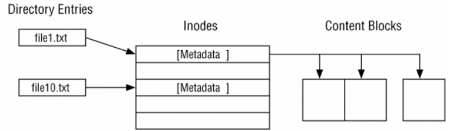
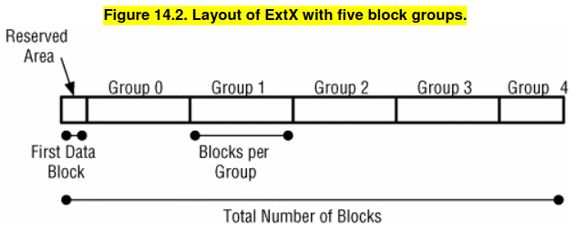
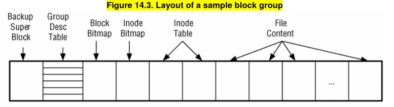
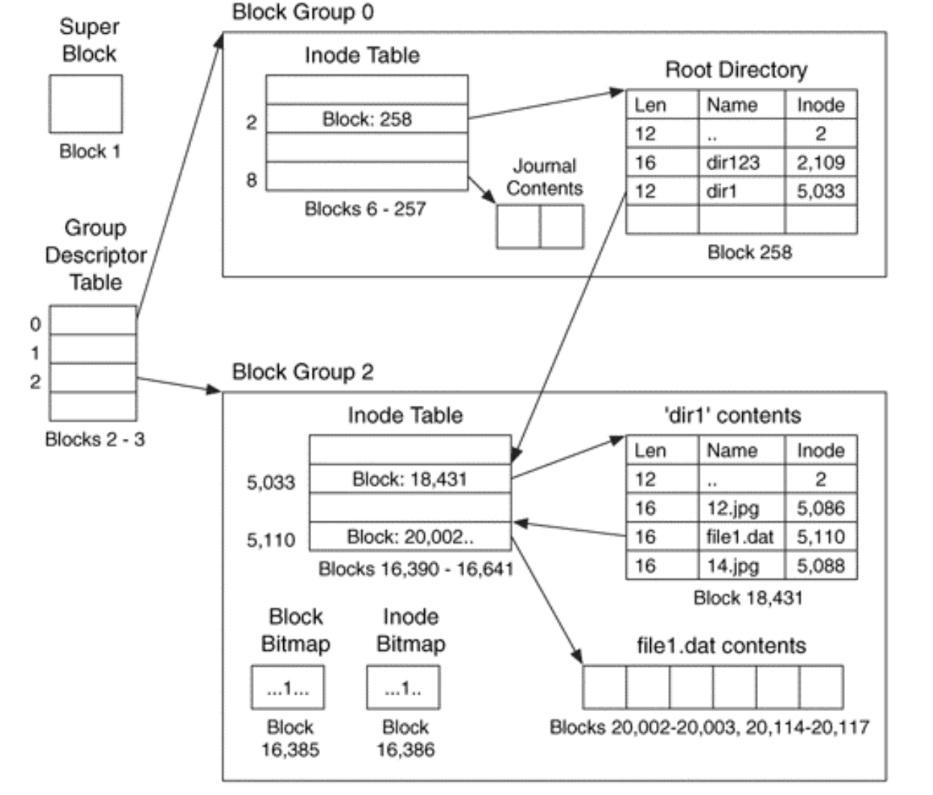

## NOTES FROM THE BOOK

Layout information is stored in the Super-Block data structure, at the beginning of the file-system.
The layout is divided into : 
- reserved area : optional at the beginning
- the remainder : divided into sections called **block groups**, each one of the same number of blocks and used to store files' name, metadata and content.

File content is stored in **blocks** which are groups of consecutive sectors.
File metadata is stored in **inodes** data structures that has a fixed size and is locatd in a inode table ( each block group has a inode table ).
Additional metadata may be stored in extended attributes
File name is stored in **directory** data structure that are very simple, storing only the file's name and a pointer to the file's inode entry.

Each block group has a **Group Descriptor** data structure that describes the layout of the group.
Group descriptors are located in a **Group Descriptor Table** located after the Super-Block.
Copies of the Super-Block and the Group Descriptor Table can be found throughout the file-system.

The block bitmap manages the allocation status of the blocks in the group.
The inode bitmap manages the allocation status of the inodes in the group.
If EXT contains the OS kernel it may have boot code and will be executed after the control is passed to it by the **Master Boot Record**.

EXT is designed to be extensible via optional features:
- **compatible features** : if not supported the OS can still mount the FS
- **incompatible features** : if not supported the FS should not be mounted
- **read only compatible features** : if not supported the OS can still read only mount the FS 

#### Places to hide data
- The first 1024 bytes are not technically used
- There are unused bytes in the Super Block
- There can be unused entries in the Group Descriptor Table
- There are reserved Group Descriptor Table blocks
