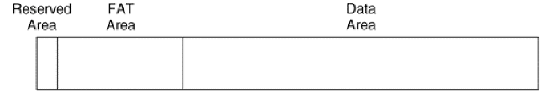

## Outline
The disk is divided into *clusters* which are group of sectors whose size is defined in the *BIOS Parameter Block*.
The *File Allocation Table structure* is a table that maps clusters to files where each entry corresponds to a cluster on the disk.
When a file is written to disk it is allocated in *one or more clusters* that are linked together forming a cluster chain.
Entries in a table are useful to do *file carving*

In FAT12/16/32 :
- The number indicates *the number of bits used to identify clusters*
- *Timestamps* are in *local time*
- *Filenames* are in *MSDOS 8.3 format* and if they do not conform additional entries can store the long name
- *File Sizes* are stored as *32-bit integers*

## exFAT/FAT64
Has some advanced functionalities and can be used where NTFS is unfeasible:
- A *bitmap* tracks free clusters improving allocation and deletion operations
- Designed for *flash drives*
- File sizes are stored as 64bit integers
## Classic FAT layout
- The *Volume Boot Record* contains the *BIOS Parameter Block*
- The *root directory of FAT12/16 has a fixed size and location* while in *FAT32 the boot sector includes the locations of the root directory, FSINFO structure, boot-sector backup*
- The *reserved area* starts at sector 0  and its size is in the *Volume boot record*
- The *FAT area* follows the *reserved area*
- The *Data area* follows the *FAT area*
- *Clusters* can be found only in the *data area* and they are numbered *starting from 2* after the *root directory*

At the end of the data area there could be *unused sectors* and data could be hidden there, as well as *after the last valid entry in a FAT table*

A directory entry is 32 bytes long and  stores :
- *file name*
- *file attributes*
- *file size*
- *starting cluster*
- *time stamp informations*

## NOTES FROM THE BOOK
## Introduction

Pretty simple file system but has been modified many times during the years.
Two important data structures:
- File Allocation Table
- directory entries

Each file and directory is allocated a **directory entry** data structure that contains the file's name, size and starting address of the file content along with other metadata.
File and directory content is located in data units called **clusters**.
If more than one cluster is allocated for a file, the other ones are found by using the FAT structure.

The number in FAT **12**/**16**/**32** indicates the size of the entries in the FAT structure.
The layout of FAT is made of three physical sections:
- Reserved Area -> File system category data
- FAT Area -> Primary and backup FAT structures
- Data Area -> Clusters that store file and directory content

