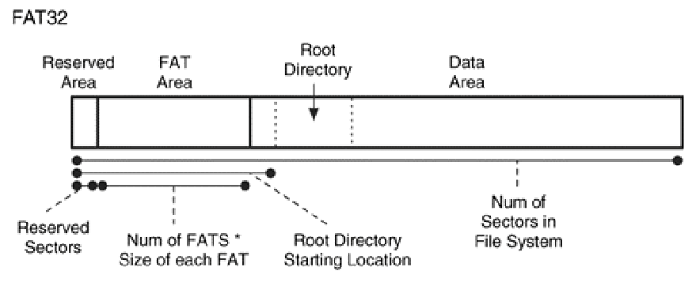

## NOTES FROM THE BOOK

Pretty simple file system but has been modified many times during the years.
Two important data structures:
- File Allocation Table
- directory entries

Each file and directory is allocated a **directory entry** data structure that contains the file's name, size and starting address of the file content along with other metadata.
File and directory content is located in data units called **clusters** which are group of sectors.
If more than one cluster is allocated for a file, the other ones are found by using the FAT structure and they form a **cluster chain**.

The number in FAT **12**/**16**/**32** indicates the size of the entries in the FAT structure.
The layout of FAT is made of three physical sections:
- **Reserved Area** -> File system category data
- **FAT Area** -> Primary and backup FAT structures
- **Data Area** -> Clusters that store file and directory content

In FAT, file-system category data can be found in the **boot sector** data structure that is located in the first sector of the volume belonging to the **BIOS Parameter Block**.
FAT32 also have a FSINFO data structure that contains information about the location of the next available cluster and the total amount of free clusters.

The first cluster is the number 2 and it's in the data area, since the **Reserved Area** and the **FAT area** do not use cluster addressing.
