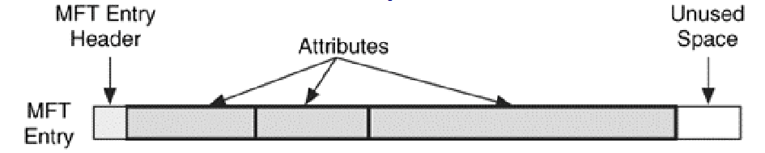
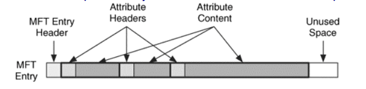
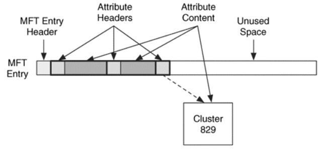
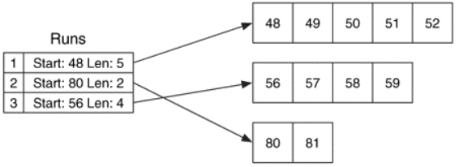
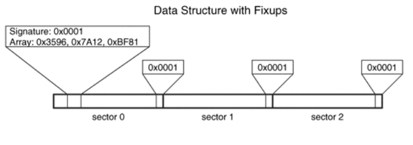

## NOTES FROM THE BOOK

A file-system that is designed for scalability where generic data structures wrap other data structures with specific content.
One example of generic wrapper is that every byte of data in NTFS is allocated to a file, even file-system administrative data that are typically hidden.
The entire file-system is considered a data area.
The only consistent layout is that the first sectors contain the boot sector and the boot code.

The **Master File Table** contains information about all the files and directories.
Every file and directory has at least one entry in the table and they are very simple:
- 42 bytes for a defined purpose
- the rest for **attributes**, that are small data structures storing specific data ( file's name, size and even the content )

The Master File Table is a file, like everything else, so it has an entry for itself that is the first one (**$MFT**) and describes its own on-disk location.
The MFT size grows sequentially and the addresses are called **file numbers** and are useful to detect possible corruptions and to recover deleted content.

Every MFT entry has a little internal structure and most of it is used to store attributes, each of the has its own internal structure.
Attributes consists of streams and applications can create additional named streams called **Alternate Data Streams**.
**ADS** are alternative data contents that do not affect each other and are usually hidden from common file listing commands.

All attributes have two parts:
- header : identifies the attribute's type, size, name and stores its flags.
- content : can have any format and **size** ( it can be stored in the MFT entry itself or can be **non-resident** and be stored in a external cluster )

**Non-resident** attributes are stored in cluster runs, which are consecutive clusters, that are documented using the starting cluster and the run length.
Run can also be **sparse** to optimize allocation space.

Attributes can also be stored compressed into compression units whose size can be found in the attribute header.
NTFS divides the file's data into **compression units 16 clusters long** that is a trade-off between producing smaller compressed files and slowing random-access read operations.

NTFS uses **index** data structure which are collection of attributes stored in a sorted order using a B-Tree, this is done to sort and find data more easily.

NTFS incorporates **fixups** values that are a signature in the last two bytes of each sector in large data structures and are used to verify sector's integrity.
Fixups are incremental for every data structure that is written and if a sector is damaged or incomplete the signature would be different from the fixup.

