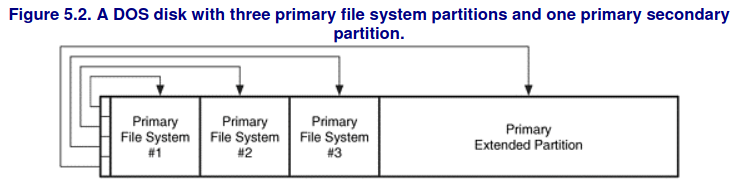
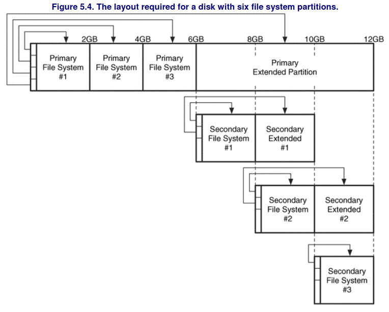
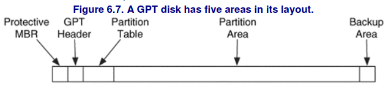

## Cylinder Head Sector 

A early method for addressing physical blocks using 3 bytes:
- 10 bits for cylinders
- 8 bits for heads
- 6 bits for sectors
Now replaced by **Logical Block Addressing ( LBA )**. 
## Master Boot Record ( MBR)

The MBR is located in the first 512-byte sector and contains **boot-code**, a **partition-table** and a **signature-value**.
Each table entry describes the layout of a partition.

The type field of a partition identifies what kind of data should exist in the partitions and Linux doesn't care about it but Windows instead relies on it.
Each entry also identifies which partition is the bootable one.

**Master Boot Record** partition style has only 4 slots for primary partitions so one is usually used as a **primary extended partition** slot that contains other partitions.
To address partitions **logical-partition addressing** is used which uses the distance from the beginning of a partition.

Inside the **primary extended partition** we find **secondary extended partitions** that contain:
- a **partition table**
- a **secondary file-system partition (logical partition)** 

A **primary file system partition** is a partition whose entry is in the MBR and the partition contains a file system or other structured data.
A **primary extended partition** is a partition whose entry is in the MBR and the partition contains additional partitions.
A **secondary file system partition** is located inside the **primary extended partition** bounds and contains a file system or other structured data.

The **boot code** exist in the first 446 bytes of the MBR and it processes the partition table to identify which partition is bootable.
Once found it executes the code contained its first sector tha will operate system-specific.
## GUID Partition Table ( GPT )

Used by the **Extensible Firmware Interface (EFI)** which replaced **BIOS**, and is currently the standard:
- supports up to **128 partitions**
- uses **64bit LBA addresses**
- keeps **mirrored backup copies of important data structures**

GPT partitioned volumes can be divided into **5 areas** :
- **Protective MBR** : in the first sector and contains a DOS partition table with one entry that spans the entire disk and its used only for compatibility with legacy systems
- **GPT header** : defines size and location of the partition table which are fixed
- **Partition Table** : each entry contains :
	- starting address
	- ending address
	- type value
	- name
	- attribute flags
	- GUID value
- **Partition Area** : contains the sectors that will be allocated to partitions. The starting and ending address are defined in the GPT header
- **Backup copy of the GPT header and partition table**

