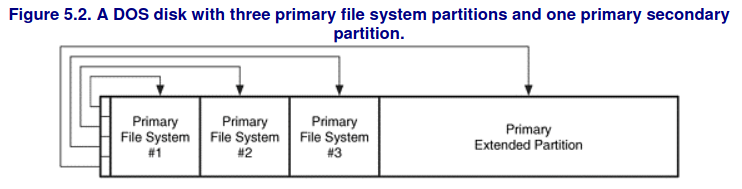

The **Cylinder-Head-Sector** was a early method for addressing physical blocks using 3 bytes:
- 10 bits for cylinders
- 8 bits for heads
- 6 bits for sectors
Now replaced by **Logical Block Addressing**.

## Master Boot Record ( MBR)
THe MBR is located in the first 512-byte sector and contains **boot-code**, a **partition-table** and a **signature-value**.
Each table entry describes the layout of a partition.

The type field of a partition identifies what kind of data should exist in the partitions and Linux doesn't care about it but Windows instead relies on it.
Each entry also identifies which partition is the bootable one.

**Master Boot Record** partition style has only 4 slots for primary partitions so one is usually used as a **primary extended partition** slot that contains other partitions.
To address partitions **logical-partition addressing** is used which uses the distance from the beginning of a partition.

Inside the **primary extended partition** we find **secondary extended partitions** that contain:
- a **partition table**
- a **secondary file-system partition (logical partition)** 

A **primary file system partition** is a partition whose entry is in the MBR and the partition contains a file system or other structured data.
A **primary extended partition** is a partition whose entry is in the MBR and the partition contains additional partitions.

## Globally Unique IDentifier ( GUID )

Used by the **Extensible Firmware Interface (EFI)** which replaced **BIOS**, and is currently the standard:
- starts with a protective **Master Boot Record**
- supports up to 128 partitions
- uses 64-bit LBA addresses
- keeps mirrored backup copies of important data structures

## File System Analysis

Can be divided in :
- **File System Category** -> Layout and Size informations : ==fsstat, fls, ffind==
- **Application Category** -> Data not needed for reading/writing a file
- **File Name Category** -> Data that assigns names to files 
- **Metadata Category** -> Data that describes files : ==ils, ifind, istat, icat==
- **Content Category** ->The actual data stored in clusters/blocks/data-units : ==blkstat, blkcat==

Each sector can have multiple addresses:
- physical address
- volume address
- FS address / cluster number
- file address / virtual cluster numbers

